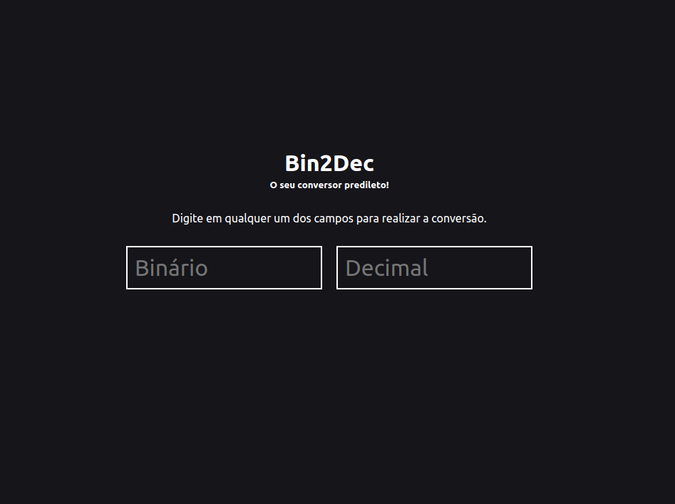

<!-- Logo -->

<h1 align="center" style="font-family: Ubuntu; font-size: 49px">
  Bin2Dec
</h1>

<!-- Badges -->

<!-- <p align="center">
  
</p> -->

<!-- Description -->
<h3 align="center">
	🚀 O seu conversor predileto! 💥
</h3>


<!-- Project Design -->

<p align="center">
  
<p>

<!-- Summary -->

# Índice

- [Índice](#índice)
  - [:bookmark: Sobre](#bookmark-sobre)
  - [:rocket: Tecnologias](#rocket-tecnologias)
  - [:book: O que aprendi](#book-o-que-aprendi)
      - [React Hooks](#react-hooks)
      - [Funções Puras](#funções-puras)
  - [:recycle: Como contribuir](#recycle-como-contribuir)
  - [:memo: Licença](#memo-licença)

<a id="sobre"></a>

## :bookmark: Sobre

Binário é o sistema numérico no qual todos os computadores digitais são baseados. Portanto, é importante que os desenvolvedores entendam a matemática binária ou de base 2. O objetivo do Bin2Dec é fornecer prática e compreensão de como funcionam os cálculos binários.

Bin2Dec permite que o usuário digite 0's e 1's e obtenha uma conversão para decimais.

Esta versão vêm com uma funcionalidade extra que também permite a conversão de decimais para binários.

<a id="tecnologias"></a>

## :rocket: Tecnologias

Essa aplicação se utiliza das seguintes tecnologias:

-  [TypeScript](https://www.typescriptlang.org/)
-  [ReactJS](https://reactjs.org/)
-  [ESLint](https://eslint.org/) (Padronização de código)
-  [Prettier](https://prettier.io/) (Formatação de código)

<a id="o-que-aprendi"></a>

## :book: O que aprendi


- #### Componentização
Foi possível visualizar a repetição de código sobre os componentes dos campos numéricos (inputs). Tendo isso em mente, foi possível "componentizar" da seguinte forma:
```jsx
const NumberInput: React.FC<Props> = ({ placeholder, value, onChange }) => {
  function handleChange(newValue: string) {
    if (!Number.isNaN(Number(newValue))) onChange(newValue)
  }

  return (
    <div className="input-container">
      <input
        value={String(value)}
        onChange={e => handleChange(e.target.value)}
        placeholder={placeholder}
      />
    </div>
  )
}
```
Dessa forma, pude respeitar o **isolamento de código** e criar um componente **reutilizável**.

#### React Hooks
Graças aos conceitos dos Hooks, foi possível respeitar um dos princípios da programação **SOLID** chamado **Single Responsability Principle**, onde cada classe/função deve ser especializada em um único assunto.

Neste caso, toda a trativa do campo binário foi isolado no hook **useBinary**.

```jsx
const useBinary = (): ReturnType => {
  const [binary, setBinary] = useState<string>()

  const handleBinary = useCallback((value: string | number) => {
    if (value === undefined) return

    const serializedValue = String(value)
      .split('')
      .map(digit => Number(digit))
      .filter(digit => digit <= 1)
      .join('')

    setBinary(oldBinary => {
      if (String(value) === oldBinary) return oldBinary

      return serializedValue
    })
  }, [])

  return {
    binary,
    handleBinary,
  }
}
```

#### Funções Puras
Esse conceito trata-se de que, para uma entrada, uma função irá sempre retornar o mesmo resultado sem efeitos colaterais.

Neste caso, foi possível isolar o cálculo de conversão de binário para decimal, que sempre retornar o mesmo resultado dada a mesma entrada.

```typescript
export default function binaryToDecimal(binary: string): number {
  const binaryDigits = String(binary)
    .split('')
    .map(digit => Number(digit))

  let convertedDecimal = 0

  for (let i = 0; i < binaryDigits.length; i += 1) {
    const digit = binaryDigits[i]

    convertedDecimal += digit * 2 ** (binaryDigits.length - i - 1)
  }

  return convertedDecimal
}
```
<a id="como-contribuir"></a>

## :recycle: Como contribuir

- Crie um fork desse repositório,
- Crie uma branch com o nome da sua feature: `git checkout -b my-feature`
- Faça um commit das suas alterações: `git commit -m 'feat: My new feature'`
- Faça um push da sua branch: `git push origin my-feature`


<a id="licenca"></a>

## :memo: Licença

Esse projeto está sob a licença MIT. Veja o arquivo [LICENSE](LICENSE) para mais detalhes.

---
<p align="center">
  Feito com ❤️ por <a href="https://github.com/igooralm192" target="_blank">IguzinhoTV</a>!!
</p>
